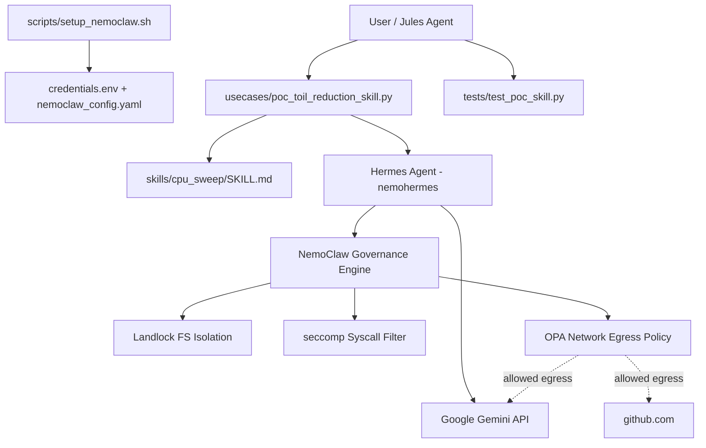
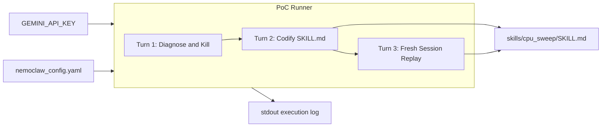
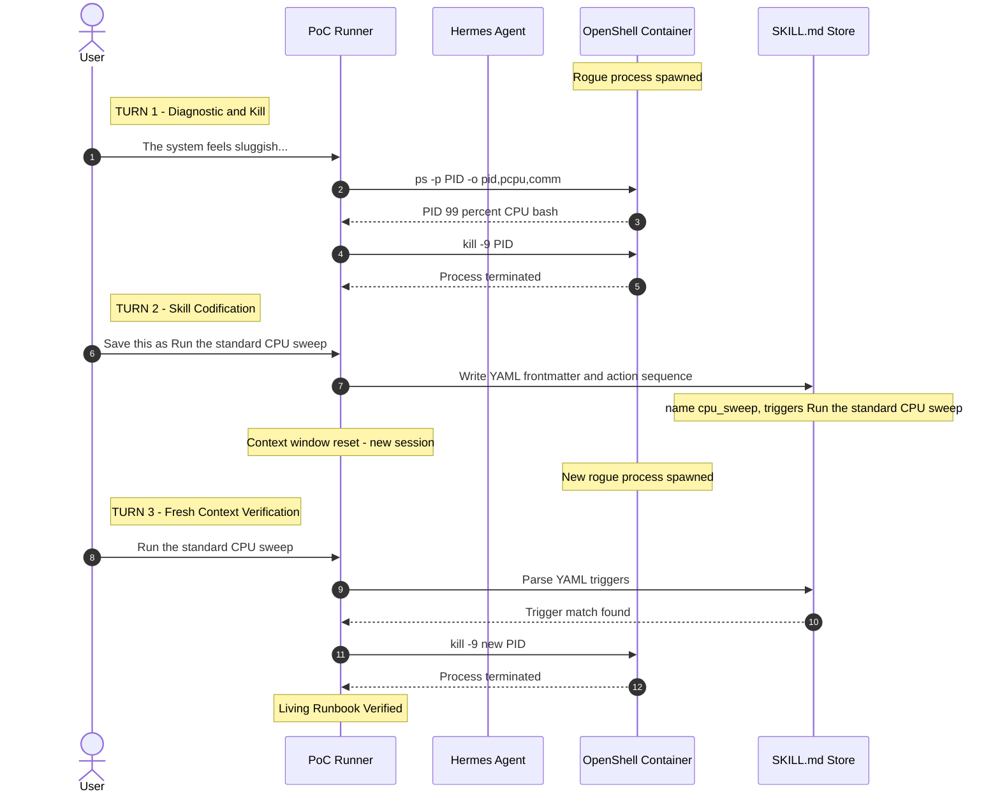
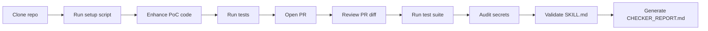

# NemoHermes — Architecture & Implementation Plan

## 1. Configuration Overview

| Parameter | Value |
|---|---|
| **Host OS** | macOS (Apple Silicon or Intel) |
| **Container Engine** | Docker Desktop |
| **LLM Provider** | Google Gemini API via `GEMINI_API_KEY` |
| **Agent Framework** | NVIDIA NemoClaw → Hermes Agent (`nemohermes`) |
| **Sandbox Runtime** | NVIDIA OpenShell (Docker-based isolation) |
| **Primary PoC** | Toil Reduction via SKILL.md (Self-Evolving Runbooks) |
| **Reference Docs** | [NemoClaw GitHub](https://github.com/NVIDIA/nemoclaw) · [OpenClaw User Guide](https://docs.nvidia.com/nemoclaw/user-guide/openclaw/home) |

---

## 2. System Architecture

### 2.1 Component Diagram



### 2.2 Data Flow: PoC Execution



---

## 3. PoC Design: Toil Reduction via SKILL.md

### 3.1 Concept
A Hermes agent learns a tribal-knowledge SRE task through interactive dialogue, codifies the procedure into a persistent `SKILL.md` file with YAML frontmatter, and in a **fresh session** (no prior context) replays the runbook immediately upon hearing the trigger phrase — proving the agent acts as a **living runbook**.

### 3.2 Sequence Diagram



### 3.3 SKILL.md File Specification

Generated by Turn 2. Must be parseable by `yaml.safe_load()`:

```yaml
---
name: cpu_sweep
version: "1.0"
description: Run standard CPU sweep to find and terminate rogue processes.
triggers:
  - "Run the standard CPU sweep"
  - "CPU sweep"
  - "standard CPU sweep"
author: hermes-agent
---
```

Followed by Markdown body with `## Action Sequence` containing fenced bash blocks.

---

## 4. Component Details

### 4.1 `usecases/poc_toil_reduction_skill.py`

The core PoC runner. Key design decisions:

| Aspect | Design |
|---|---|
| **Path resolution** | `PROJECT_ROOT = Path(__file__).resolve().parent.parent` — works from any cwd |
| **Process tracking** | Global `_spawned_pids` list; `cleanup_all_spawned()` in `finally` block |
| **Process verification** | `ps -p PID` (targeted, not system-wide `pkill`) |
| **Skill parsing** | `parse_skill_triggers()` reads YAML frontmatter via `yaml.safe_load()` |
| **Error handling** | Each turn raises `RuntimeError` on failure; `main()` catches and returns exit code |
| **Cleanup guarantee** | `finally` block in `main()` ensures no orphan processes |

### 4.2 `tests/test_poc_skill.py`

11 test cases across 3 test classes:

| Class | Tests | What It Validates |
|---|---|---|
| `TestRogueProcessLifecycle` | 2 | PID validity, process killability |
| `TestSkillFileOperations` | 6 | Directory creation, YAML frontmatter validity, required fields, trigger parsing, action commands, edge cases |
| `TestTurnSimulations` | 3 | Turn 1 kills process, Turn 2 creates SKILL.md, Turn 3 raises without SKILL.md, full end-to-end sequence |

Every test has `tearDown()` calling `cleanup_all_spawned()` + removing generated files.

### 4.3 `scripts/setup_nemoclaw.sh`

Idempotent setup script. Key features:
- Resolves project root from script location (`BASH_SOURCE`), not cwd
- Uses `set -euo pipefail` for strict error handling
- Sources `credentials.env` via `set -a` (handles quotes and spaces)
- Validates `GEMINI_API_KEY` is not the placeholder value
- Gracefully handles clone/install failures with warnings (not crashes)

### 4.4 `config/nemoclaw_config.yaml`

Sandbox isolation policy template:

```yaml
sandbox:
  isolation:
    landlock: true          # Linux filesystem restriction (active inside container)
    seccomp: true           # Syscall filtering
    network_policy:
      allowed_egress:
        - "generativelanguage.googleapis.com:443"  # Gemini API
        - "github.com:443"                          # Source repos
        - "pypi.org:443"                            # Python packages
```

> **Note**: Landlock and seccomp are Linux kernel features enforced *inside* the Docker container. macOS host uses Docker's own hypervisor isolation layer.

---

## 5. Gemini API Integration

| Parameter | Value |
|---|---|
| **SDK** | `google-genai>=1.0.0` (in `requirements.txt`) |
| **Auth** | `GEMINI_API_KEY` env var or `config/credentials.env` |
| **Model** | `gemini-2.5-flash` (configurable in `nemoclaw_config.yaml`) |
| **Endpoint** | `generativelanguage.googleapis.com:443` |
| **Cost** | Within \$10/month Google AI Pro allowance |

The Hermes agent has a **native Gemini provider** that translates its internal tool/message loop directly into Gemini's `generateContent` API — no OpenAI compatibility wrapper needed.

---

## 6. Maker-Checker Execution Flow



See:
- [`prompts/jules_maker_prompt.md`](prompts/jules_maker_prompt.md) for Maker task spec
- [`prompts/jules_checker_prompt.md`](prompts/jules_checker_prompt.md) for Checker audit spec

---

## 7. Verification Plan

### Automated
```bash
# Unit + integration tests (11 cases)
python3 -m unittest discover -s tests -v

# PoC end-to-end run
python3 usecases/poc_toil_reduction_skill.py

# Secret leak scan
git grep -i "api_key\|secret\|token\|password" -- ':!*.example' ':!*.md'
```

### Manual
- Inspect generated `skills/cpu_sweep/SKILL.md` for correct YAML frontmatter
- Verify no orphan bash processes left after PoC run: `ps aux | grep "while true"`
